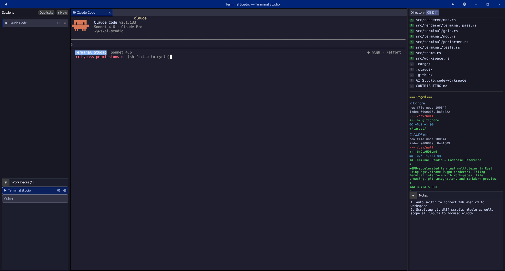

# Terminal Studio


[](LICENSE)


[](https://github.com/dpkay-io/terminal-studio/releases)
[](https://github.com/dpkay-io/terminal-studio/releases/latest)
[](https://github.com/dpkay-io/terminal-studio/actions/workflows/ci.yml)

> **Alpha software** — core features work, but expect bugs and breaking changes between releases. Bug reports are very welcome.



**Terminal Studio** is a GPU-accelerated terminal multiplexer built with Rust, [egui](https://github.com/emilk/egui), and the wgpu renderer. It combines multi-pane terminals with an integrated file browser, git diff viewer, markdown renderer, and a workspace system — all in a single frameless window with hardware-accelerated text rendering.

---

## Features

- **Multi-pane terminal** — split horizontally or vertically into as many panes as you need, each independently resizable with drag dividers
- **GPU rendering via wgpu** — smooth, pixel-perfect text rendered on the GPU through egui's wgpu backend
- **Full VTE/ANSI emulation** — 256-color, SGR attributes, mouse reporting, bracketed paste, alternate screen (same VTE parser as Alacritty)
- **Workspace system** — named workspaces bound to directories; custom accent color auto-activates when your CWD matches
- **File browser** — recursive directory tree with `.gitignore` support; click any file to open it, `.md` files open in the markdown previewer
- **Git integration** — staged/unstaged diff viewer with colored hunks, inline/side-by-side modes, stage/unstage/commit/push from the UI
- **Command palette** — `Ctrl+Shift+P` for quick access to 50+ actions
- **Syntax highlighting** — powered by syntect (Sublime Text grammars) for file editor and diff views
- **15 built-in themes** — Catppuccin Mocha, Dracula, Nord, and more; switch in Settings
- **Configurable fonts & cursor** — adjust terminal font size, cursor style (block/underline/bar), and scrollback limit
- **Custom keybindings** — remap any shortcut via Settings or `keybindings.json`
- **In-terminal search** — `Ctrl+F` to search within the active terminal; cross-session fuzzy search in the session list
- **Integrated markdown renderer** — headers, bold, code blocks, lists, blockquotes
- **Integrated file editor** — edit any file in a center pane with `Ctrl+S` to save
- **Per-workspace notes** — scratch-pad scoped to each workspace, auto-saved
- **Session persistence** — open terminals and their CWDs are restored on next launch
- **System monitor** — live CPU, RAM, and network stats in the status bar
- **Auto-update** — checks GitHub releases once per day; one-click update from the toolbar
- **Multi-window** — open workspaces in separate OS windows

See [FEATURES.md](FEATURES.md) for the full feature list.

---

## Installation

### Download (recommended)

Grab the latest package for your platform from the [**Releases page**](https://github.com/dpkay-io/terminal-studio/releases/latest):

| Platform | Recommended | Bare binary |
|---|---|---|
| **Windows** x86-64 | [`terminal-studio-setup.exe`](https://github.com/dpkay-io/terminal-studio/releases/latest/download/terminal-studio-setup.exe) — installer with Start Menu shortcut, optional PATH, and uninstaller | `terminal-studio-windows.exe` |
| **macOS** Apple Silicon | [`terminal-studio-macos-arm.dmg`](https://github.com/dpkay-io/terminal-studio/releases/latest/download/terminal-studio-macos-arm.dmg) — drag-to-Applications disk image | `terminal-studio-macos-arm` |
| **Linux** x86-64 (Debian/Ubuntu) | [`terminal-studio-linux-amd64.deb`](https://github.com/dpkay-io/terminal-studio/releases/latest/download/terminal-studio-linux-amd64.deb) — `sudo dpkg -i terminal-studio-linux-amd64.deb` | `terminal-studio-linux` |

> The bare binaries are single-file executables — download, make executable (`chmod +x` on Unix), and run. No installer needed.

### Shell one-liner

**Linux / macOS**

```sh
curl -fsSL https://raw.githubusercontent.com/dpkay-io/terminal-studio/master/scripts/install.sh | sh
```

Downloads the latest release binary to `~/.local/bin/terminal-studio`. Override the destination with `INSTALL_DIR=/your/path`.

**Windows (PowerShell)**

```powershell
iwr https://raw.githubusercontent.com/dpkay-io/terminal-studio/master/scripts/install.ps1 | iex
```

Installs to `%LOCALAPPDATA%\terminal-studio\terminal-studio.exe`.

### Homebrew (macOS)

```sh
brew install --cask dpkay-io/tap/terminal-studio
```

> Requires the [Homebrew tap](https://github.com/dpkay-io/homebrew-tap) to be set up. The tap is auto-updated on each release.

---

### Building from Source

#### Prerequisites

**All platforms** — Rust stable toolchain 1.75 or newer:

```sh
curl https://sh.rustup.rs -sSf | sh        # Linux / macOS
winget install Rustlang.Rustup              # Windows
```

**Windows** — [Visual Studio Build Tools](https://visualstudio.microsoft.com/visual-cpp-build-tools/) with the **Desktop development with C++** workload (required for MSVC linking).

**Linux**

```sh
sudo apt install pkg-config libxkbcommon-dev libwayland-dev
# X11 (optional):
sudo apt install libx11-dev libxcb1-dev
```

> **Locale note:** If your `LANG` is set to a bare locale without a UTF-8 codeset (e.g. `en_IN` instead of `en_IN.UTF-8`), you may see a flood of `xkbcommon: ERROR` messages about Compose file parsing at startup. The app still works — only Compose/dead-key input is affected. Fix by setting `LANG=en_IN.UTF-8` (or your locale's `.UTF-8` variant) in `/etc/default/locale` or `~/.profile`.

**macOS**

```sh
xcode-select --install
```

#### Build

```sh
git clone https://github.com/dpkay-io/terminal-studio
cd terminal-studio
cargo build --release
# Binary: target/release/terminal-studio  (terminal-studio.exe on Windows)
```

---

## Updating

Terminal Studio checks for updates automatically once per day. When an update is available, an **Update** button appears in the toolbar.

**To update manually:** open Settings (`Ctrl+Shift+,`) → scroll to **About** → click **Update to vX.Y.Z**.

The update downloads in the background. When ready, click **Restart to finish update**. Your terminal sessions are preserved when "Restore last session" is enabled in Settings.

---

## Usage

### Keyboard shortcuts

| Shortcut | Action |
|---|---|
| `Ctrl+Shift+P` | Open command palette |
| `Ctrl+Shift+C` | Copy selection |
| `Ctrl+Shift+V` | Paste from clipboard |
| `Ctrl+S` | Save the active file-editor pane |
| `Ctrl+F` | Find in terminal |
| `Ctrl+Shift+\` | Split pane horizontally |
| `Ctrl+Shift+-` | Split pane vertically |
| `Ctrl+Shift+W` | Close active pane |
| `Alt+Arrow` | Move focus between split panes |
| `Ctrl+Tab` | Next tab |
| `Ctrl+Shift+Tab` | Previous tab |
| `Ctrl+Shift+,` | Open settings |

Terminal key sequences (`Ctrl+L`, `Ctrl+D`, `Ctrl+C`, etc.) pass through directly to the running shell. All shortcuts are customizable in Settings or via `keybindings.json`.

### Managing panes

- Click **+** in the tab bar to open a new terminal pane.
- Use `Ctrl+Shift+\` / `Ctrl+Shift+-` to split the active pane.
- Drag the divider between split panes to resize.
- Close a pane with its **×** button or `Ctrl+Shift+W`.

### Workspaces

1. Click **+ Workspace** in the left sidebar.
2. Enter a name and select the root directory.
3. An accent color is assigned automatically (pick from the preset palette to override).
4. Whenever a terminal's CWD falls under a workspace path, that workspace activates and its color tints the UI.

### File browser and editor

- The right panel shows the directory tree for the active terminal's CWD.
- Click any file to open it in an editor pane; `.md` files open in the markdown previewer.
- `Ctrl+S` saves changes.

### Git diff viewer

Switch to the **Git** tab in the right panel for a live diff of the working tree relative to HEAD. Files are grouped into staged and unstaged sections. Click any file to expand its hunk view (inline or side-by-side). Stage, unstage, commit, and push directly from the UI.

---

## Development

```sh
cargo run                           # debug build (faster compile)
cargo test                          # all unit tests
cargo clippy                        # lints
RUST_LOG=debug cargo run            # with debug logging (Linux / macOS)
$env:RUST_LOG="debug"; cargo run    # Windows PowerShell
```

---

## Data and Configuration

All state is stored in a platform-specific directory — no config files next to the binary.

| Platform | Path |
|---|---|
| Windows | `%APPDATA%\terminal-studio\` |
| Linux / macOS | `~/.config/terminal-studio/` |

| File | Contents |
|---|---|
| `session.json` | Open panes, CWDs, active workspace, panel layout |
| `workspaces.json` | Workspace definitions (name, path, color) |
| `notes.json` | Per-workspace scratch-pad notes |
| `settings.json` | User preferences (theme, font size, cursor style, scrollback) |
| `keybindings.json` | Custom keyboard shortcuts |

Delete the directory to reset all state.

---

## Platform Support

| Feature | Windows | Linux | macOS |
|---|---|---|---|
| PTY backend | ConPTY | openpty | openpty |
| Default shell | PowerShell | Bash | Bash |
| File watcher | ReadDirectoryChangesW | inotify | FSEvents |
| State directory | `%APPDATA%` | `~/.config` | `~/.config` |

---

## Alpha Status

Known gaps:

- Linux and macOS are less tested than Windows
- The terminal emulator handles most TUI apps well but may have gaps with advanced escape sequences
- Split pane layout is not persisted across restarts

If you hit a bug, please [open an issue](https://github.com/dpkay-io/terminal-studio/issues). Include your OS, shell, and the app or escape sequence that triggered the problem.

---

## Contributing

Bug reports are the most helpful contribution right now. For non-trivial code changes, open an issue to discuss first.

See [CONTRIBUTING.md](CONTRIBUTING.md) for details.

---

## License

Apache License, Version 2.0 — see [LICENSE](LICENSE).
